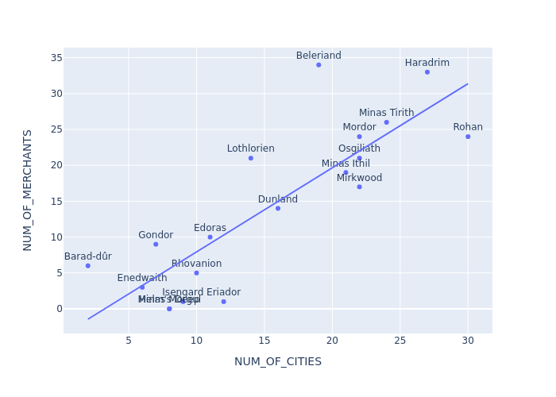

# Mordor demography

## Running the application

To run the application, be sure to install the packages listed in **requirements.txt** by running:

`pip install -r requirements.txt`

after which you can run the code with:

`python3 main.py`

## Documentation

### Quality of the data

Before beginning to program the solution, I first looked at the provided JSON data and looked for discrepencies. Generally, the data is quite clean. However, with the help of the hints described in the instructions, I was able to identify the following abnormalities:

There were objects, that had whitespaces in the key / value, such as 

    "MORDOR_ID": "  9afcbc9d-fca1-4b54-b1c2-df68c9756399",
    "MIDDLE_EARTH_REGION": "Dunland"

Some had missing values altogether:

    "MORDOR_ID": "f824ea0a-87a3-4fbb-ac92-98887c7400f7",
    "CITY_NAME": "",
    "CITY_ID": ""


Duplicates were also left out (keep one), such as:


    "MORDOR_ID": "778fd3d7-1713-429c-bc3f-b0772b73fe08",
    "MIDDLE_EARTH_REGION": "Helm's Deep"

    "MORDOR_ID": "778fd3d7-1713-429c-bc3f-b0772b73fe08",
    "MIDDLE_EARTH_REGION": "Helm's Deep"

There were some duplicates that have the same name, but different id, such as:

    "MORDOR_ID": "d66fb705-d43e-4de4-8cd9-7d12c830b802",
    "MIDDLE_EARTH_REGION": "Minas Tirith"
 
    "MORDOR_ID": "e04841ec-2ff2-4a37-b10d-722d70cc8ba6",
    "MIDDLE_EARTH_REGION": "Minas Tirith"
 

 which will result in both of them being appended in the dataframe. For the sake of matching cities with the regions, I decided to keep these.

There are some "unwanted" characters as well, such as: 

    "MORDOR_ID": "ab1678fc-9b15-4861-a818-bdf368635204",
    "MIDDLE_EARTH_REGION": "Barad-d\u00fbr"
 

for û. However, this is only used to accomoddate the JSON syntax. This is achieved using Unicode escape.

Some stores exist in two cities, such as:

    "CITY_ID": "4a696675-eaca-4627-b9f4-8137d894c5a4"
    "MERCHANT_NAME": "Lunar Lane"

    "CITY_ID": "4b141606-f401-4348-b093-d9ed48c4d337",
    "MERCHANT_NAME": "Lunar Lane"
 
 It is unclear if these are two sepereate merchants in different cities or an error in the data. I decided to keep both of them.

Some cities did not correspond with any region, such as:

    "MORDOR_ID": "69585805-6937-4525-b000-afa23622093a",
    "CITY_NAME": "Aeternum",
    "CITY_ID": "0f647a37-dff7-4a7a-814e-df853503e5bb"

the *MORDOR_ID* is not a valid ID.

Some cities have no stores, such as:

    "MORDOR_ID": "ab1678fc-9b15-4861-a818-bdf368635204",
    "CITY_NAME": "Burke",
    "CITY_ID": "1062460b-e6af-4b2e-9468-e854907713a7"

The cleaning of the data is defined by the function :

```python
def clean_data(dataframe: pd.DataFrame) -> pd.DataFrame:
```

### Insights

The next step was to gather some insights about the data. The output is printed in the console, with five regions with the most cities, and five cities with the most merchants. 

```
The regions with the most cities are:
MIDDLE_EARTH_REGION  NUM_OF_CITIES  NUM_OF_MERCHANTS
              Rohan             30                24
           Haradrim             27                33
       Minas Tirith             24                26
          Osgiliath             22                21
             Mordor             22                24

The cities with the most merchants are:
    CITY_NAME  NUM_OF_MERCHANTS MIDDLE_EARTH_REGION
City of Doors                15           Beleriand
     Amaranth                11          Lothlorien
      Eriador                 8            Haradrim
     Bordeaux                 7        Minas Tirith
         Arik                 7           Osgiliath
```

For the purpose of defining outliers and correlation patterns, the number of merchants was added to the above dataframe. This will help with the plotting of the data and readability. The region of the city in the lower dataframe was added for curiosity purposes.

When plotting the data points, we can see a pattern:



As the number of cities in a region grows, so does the number of merchants. There are a few outliers, as is evident in the image. The most obvious one is *Beleriand*.

I also decided to print some additional information such as the total number of cities, total number of merchants, averages, and medians.

### Data mangling

Finally, a nested dictionary is presented, with the format of 

```
{ Region:
    { City: [Merchants....],
      City2: [Merchants....]
    },
  Region2:
    {....
    },
  Region3.....
}
```

The output we get looks something like this: 

```
"Lothlorien": {
        "Anatole": [],
        "Bond": [
            "The Golden Falcon"
        ],
        "Baxter": [],
        "Amadis": [
            "The Sorcerer's Sanctum"
        ],
        "Carl": [],
        "Brecken": [
            "The Mystic Bazaar",
            "The Mage's Magic"
        ],
```